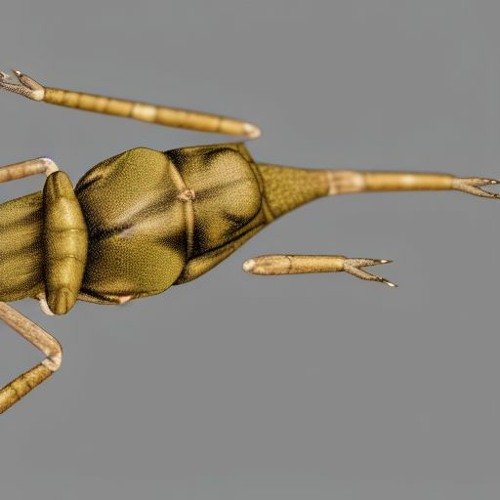

# sanidid [qdrone V0.7]
---

The idea from this track came from a so called "AI hallucination". These large visual models are never taught to understand or reproduce text or grammar, however, they have been shown to develop latent grammatical and semantical structures. On one of my experimentations with [stability.ai's dreamstudio](https://beta.dreamstudio.ai/), I stumbled across the letters *sanidid* written on a wall. When I returned those images to the network as a prompt, I got the image above.

In the [track](https://postcarboncollective.bandcamp.com/track/sanidid-qdrone-v07) and respective [music video](https://youtu.be/8sNWhb8dZ4E), I explored the latent spaces between the several iterarions of this *sanidid*.

This repo contains the track's [source code](./postcarbon.tidal) , two drafted takes of the track sanidid - [qdrone V0.7], and the [stills used to make the video](./video_assets/).

*sanidid [qdrone V0.7]* was composed and produced for postcarbon collective's compilation - mechaworks.

Buy the compilation here: 
https://postcarboncollective.bandcamp.com/album/mechaworks

---

### Technical specs:

#### Track:
sanidid [qdrone V0.7] was fully produced and recorded live using open-source live-coding software on a linux mint laptop.

- Composition and performance: tidalcycles;
- Custom synths: supercollider;
- Recording: ardour;

#### Video:

- Images generated using [stability.ai's dreamstudio](https://beta.dreamstudio.ai/)
- video edited using kdnelive
- background footage collected at ria de aveiro, PT
